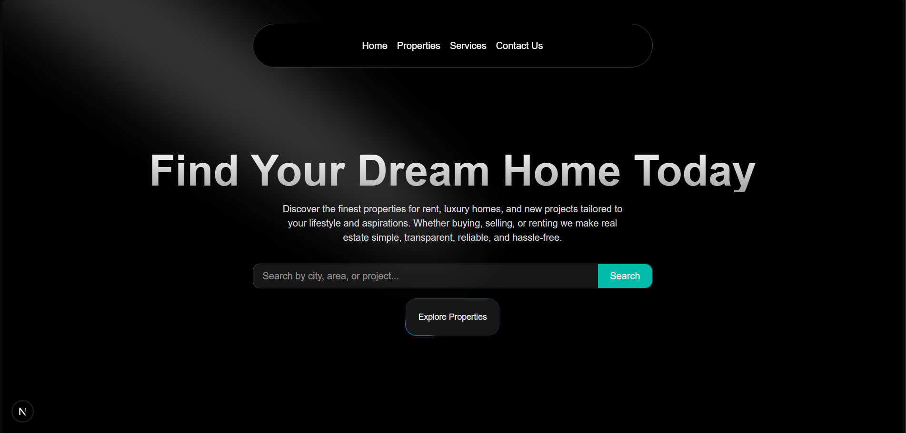
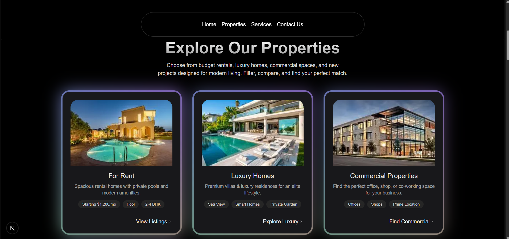
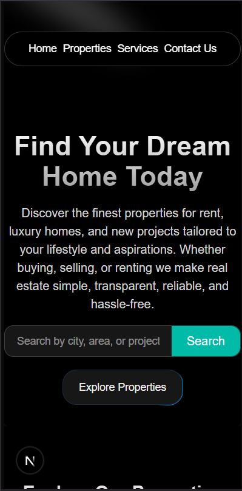
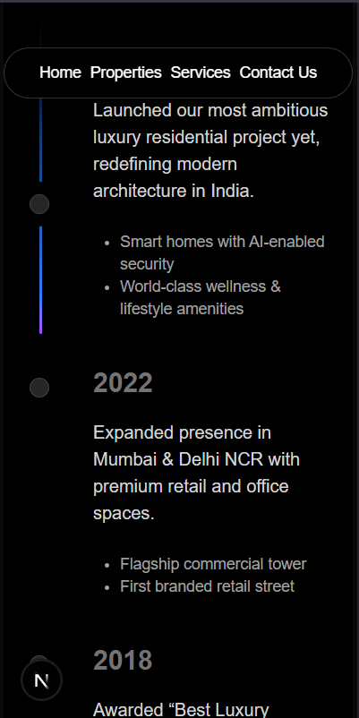
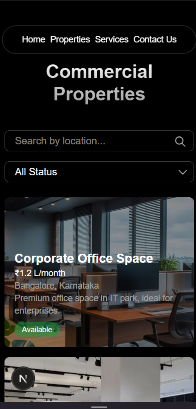

# DreamSpace Real Estate — Luxury Real Estate Landing Page

A modern, animated landing page for **DreamSpace Real Estate**, built to showcase luxury properties, services, and connect clients with real estate experts. The site is fully responsive and features smooth animations and a polished user experience.

<p align="center">
<video width="800" height="450" controls autoplay muted loop> <source src="./public-/preview/DreamSpace-real-Estate.mp4" type="video/mp4"> <source src="/demo.webm" type="video/webm"> Your browser does not support the video tag. </video>
  
  
  
  
  
</p>

---


---

## ✨ Features

- **Hero Section** — Spotlight hero with search bar and call-to-action
- **Properties** — Browse properties by category (For Rent, Luxury Homes, Commercial, New Projects)
- **Services** — Property buying/selling assistance, management, loans, and legal documentation
- **Timeline** — Step-by-step journey for buying or renting properties
- **Testimonials** — Client reviews with infinite scrolling cards
- **Agents** — Meet the team with interactive hover effects
- **Responsive Navbar** — Dropdown menus for Properties and Services
- **Contact Page** — Get in touch with the team
- **Dynamic Routes** — Dedicated pages for each service and property category
- **shadcn/ui Components** — Production-ready, customizable UI components

---

## 🛠 Tech Stack

| Technology | Purpose |
|------------|---------|
| **Next.js 15** | App router, server components, routing |
| **React 19** | UI components |
| **Tailwind CSS 4** | Styling |
| **Motion** | Animations and transitions |
| **TypeScript** | Type safety |
| **Lucide React** | Icons |

---

## 🚀 Getting Started

### Prerequisites

- **Node.js** 18.17 or later
- **npm**, **yarn**, or **pnpm**

### Installation

1. Clone the repository:

   ```bash
   git clone https://github.com/ruturkoladiya/luxury-real-estate-landing.git
   cd luxury-real-estate-landing
   ```

2. Install dependencies:

   ```bash
   npm install
   ```

3. Run the development server:

   ```bash
   npm run dev
   ```

4. Open [http://localhost:3000](http://localhost:3000) in your browser.

### Available Scripts

| Command | Description |
|---------|-------------|
| `npm run dev` | Start dev server with Turbopack |
| `npm run build` | Build for production |
| `npm run start` | Start production server |
| `npm run lint` | Run ESLint |

---

## 📁 Project Structure

```
src/
├── app/                    # Next.js app router
│   ├── contact-us/         # Contact page
│   ├── properties/[category]/  # Dynamic property pages
│   ├── services/[service]/     # Dynamic service pages
│   ├── layout.tsx
│   └── page.tsx
├── components/             # React components
│   ├── HeroSection.tsx
│   ├── PropertiesSection.tsx
│   ├── ServiceSection.tsx
│   ├── TimeLineSection.tsx
│   ├── Testimonial.tsx
│   ├── Agents.tsx
│   ├── Navbar.tsx
│   ├── Footer.tsx
│   └── ui/                 # Shared UI components
├── data/
│   └── dummyData.js        # Services, agents, testimonials
└── utils/
    └── cn.ts               # Class name utilities
```

---

## 📄 Pages & Routes

| Route | Description |
|-------|-------------|
| `/` | Home page with all sections |
| `/contact-us` | Contact form |
| `/properties/for-rent` | Rental properties |
| `/properties/luxury-homes` | Luxury homes |
| `/properties/commercial-properties` | Commercial listings |
| `/properties/new-projects` | New developments |
| `/services/buy-property` | Property buying assistance |
| `/services/sell-property` | Property selling assistance |
| `/services/manage-property` | Property management |
| `/services/loans` | Home loans & financing |
| `/services/legal-documentation` | Legal & documentation |

---

## 📝 License

This project is private. All rights reserved.
